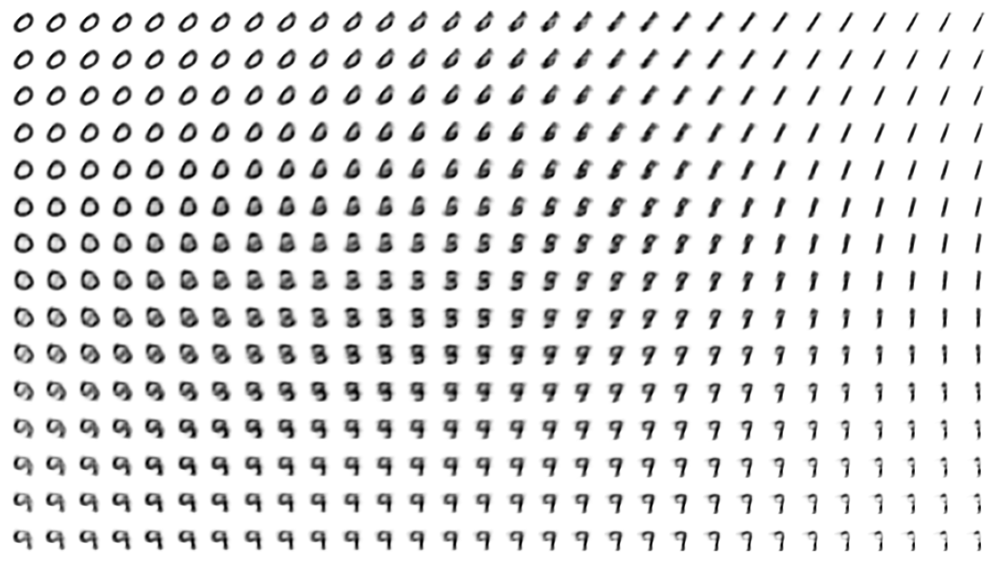

# Вариационный автоэнкодер для генерации цифр схожих на датасет MNIST

__Создадим 2 различнные модели VAE и оценим качество генерации изображений цифр. Построим картинку с плавными переходами между цифрами благодаря семплированию из латентного пространства.__

Модели:
1.   Вариационный автоэнкодер с использованием сверток ([Conv2d](https://pytorch.org/docs/stable/generated/torch.nn.Conv2d.html#torch.nn.Conv2d)) в энкодере (слои отвечающие за среднее и отклонение остаются полносвязными), и с развертками ([Conv2dTranspose](https://pytorch.org/docs/stable/generated/torch.nn.ConvTranspose2d.html#torch.nn.ConvTranspose2d)) в декодере. Размерность скрытого вектора равна двум 

2.  Вариационный автоэнкодер с использованием сверток (Conv2d) в энкодере (слои отвечающие за среднее и отклонение остаются полносвязными), и с развертками ([Upsample](https://pytorch.org/docs/stable/generated/torch.nn.Upsample.html#torch.nn.Upsample), [Conv2d](https://pytorch.org/docs/stable/generated/torch.nn.Conv2d.html#torch.nn.Conv2d)) в декодере. Размерность скрытого вектора равна двум. 

Для построения изображения постепенного перехода цифр создадим сетку из N на N изображений, где по оси Х изменяется значение первого элемента **z** из получившегося латентного пространства, а по оси Y - второго элемента **z**. Построю такие сетки для каждой обученной модели

  
  

---
 
 > Решение данного проекта представлено в формате jupiter notebook: - [VAE.ipynb](https://github.com/Koldim2001/Digit_generator_VAE/blob/main/VAE.ipynb)

